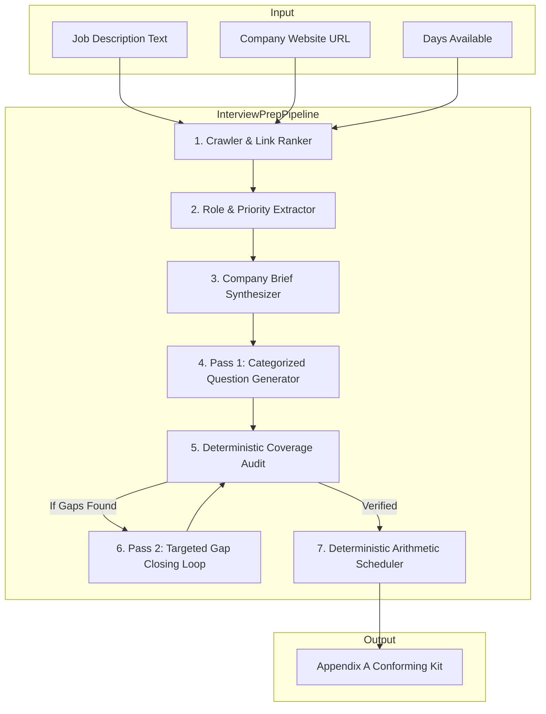

# AI Interview Preparation Platform
**Autonomous Research & Strategy Engine**  
*Document ID: `FS-AI-INTERVIEW-01`*

---

## 1. Project Overview & Tech Stack Justification

The **AI Interview Preparation Platform** converts any pasted job description and company URL into a comprehensive, tailored interview preparation kit. It crawls the target company domain, extracts verified requirements, enforces deterministic two-pass coverage, and constructs an arithmetic study schedule with interactive flashcards, live inline kit editing, and an AI mock interview studio.

### Tech Stack Choices
- **Frontend**: Next.js 14 (App Router) + Tailwind CSS + Lucide Icons + Framer Motion
  - *Rationale*: Server/client component isolation, fast SSR/hydration, clean typography, responsive dark-mode aesthetics, and low latency state updates without full-page re-renders.
- **Backend API**: Node.js + Express
  - *Rationale*: Clear separation between RESTful endpoints, SSE progress streaming, and the shared research/generation pipeline.
- **Persistence Layer**: MongoDB with zero-config local storage fallback (`.data/`)
  - *Rationale*: Allows full persistence across sessions with user isolation while enabling any reviewer to clone and run the project immediately without configuring external databases.
- **AI / LLM Provider**: Google Gemini 1.5 Flash (via `@google/generative-ai`)
  - *Rationale*: Free-tier compliant, fast multi-token throughput, native structured JSON generation, wrapped in an exponential-backoff rate-limiter with offline heuristic fallbacks.
- **Crawler & Retrieval**: Cheerio + Axios + robots-parser + custom SSRF protection
  - *Rationale*: Lightweight, fast DOM parsing, heuristic link scoring for career/handbook discovery, and safe request boundaries.

---

## 2. Setup & Installation Instructions

### Local Quickstart

1. **Clone the repository and install dependencies**:
   ```bash
   npm install
   ```

2. **Configure Environment Variables**:
   ```bash
   cp .env.example .env
   ```
   Add your Gemini API Key in `.env`:
   ```env
   GEMINI_API_KEY=your_gemini_api_key_here
   GEMINI_MODEL=gemini-1.5-flash
   ```
   *(Note: A deterministic fallback engine is built-in, so tests and offline evaluations run successfully even without an API key).*

3. **Run the Development Server**:
   ```bash
   npm run dev
   ```
   - Frontend UI: `http://localhost:3000`
   - Express Backend API: `http://localhost:5000`

4. **Run Automated Test Suite**:
   ```bash
   npm test
   ```

---

## 3. Mandatory Batch Entry Point (Section 9)

Run the batch evaluation pipeline over any JSON file of cases:

```bash
npm run evaluate -- --input <cases.json> --output <kits.json>
```

### Example:
```bash
npm run evaluate -- --input examples/sample_cases.json --output examples/sample_kits.json
```

- **Appendix B Compliant**: Produces output with exact `version`, `generated_at`, and `kits: [{ id, status: "ok" | "failed", kit, error }]` shape.
- **Shared Pipeline**: Executes the exact same core pipeline (`InterviewPrepPipeline`) used by the web application.
- **Robust Error Handling**: Unreachable or 404 domains are recorded honestly as `status: "ok"` with empty brief sources or `status: "failed"` if generation cannot proceed, never crashing the entire batch run.

---

## 4. High-Level Architecture & Pipeline Sequencing



### Deliberate Sequencing Rationale
1. **Company Retrieval**: Crawls homepage, discovers and ranks links (`/careers`, `/handbook`, `/about`, `/engineering`), cleaning HTML and extracting hiring signals.
2. **Requirement Extraction**: Dissects JD into role title, seniority, responsibilities, and structured requirements (`id: r1..rn`, `kind: technical | behavioural | domain`, `priority: must | nice`).
3. **Company Brief Synthesis**: Generates honest company summary and what they do without fabricating undisclosed facts.
4. **Dedicated Category Sequencing**: Technical, system design, behavioural, and company-fit questions are generated in separate, focused passes to maintain high topical signal.
5. **Deterministic Second Pass Loop**: Inspects `requirement_ids` against extracted `must` requirements. If any must-have requirement lacks mapped questions, targeted prompts generate questions specifically for those missing IDs.
6. **Deterministic Arithmetic Scheduler**: Allocates questions into exactly `days_available` buckets with integer minutes, ensuring harder/must-have topics land early.

---

## 5. State Representation in the Builder (Section 6)

### How Generated, Edited, and Pinned State is Preserved
The hardest state challenge in the assessment is allowing individual section regeneration (e.g. regenerating "Technical" questions or "Brief") without clobbering user edits, custom questions, or reordered items.

**Our Data Model**:
```typescript
interface Question {
  id: string;
  requirement_ids: string[];
  category: 'technical' | 'behavioural' | 'system-design' | 'company-fit';
  prompt: string;
  answer_outline: string;
  difficulty: number; // 1 to 3
  is_pinned?: boolean;  // User explicitly locked this item
  is_edited?: boolean;  // User edited prompt or outline inline
  is_custom?: boolean;  // User created this question by hand
}
```

**Regeneration Merge Algorithm**:
When `regenerateSection(kit, category)` is triggered:
1. All questions where `q.category !== category` are retained.
2. All questions in `category` where `q.is_pinned || q.is_edited || q.is_custom` are **strictly preserved in place**.
3. Only unmodified generated items in that category are replaced with freshly generated questions.
4. Deterministic coverage and schedule allocation are recomputed to maintain consistency.

---

## 6. Deterministic Schedule Allocation (Section 8)

The schedule is generated purely through arithmetic and allocation in code (not left to an LLM):
- **Exact Day Matching**: `schedule.days.length === schedule.days_available`.
- **Difficulty & Priority Scoring**: Questions are scored:
  $$\text{Score} = (\text{Difficulty} \times 10) + (\text{Must-have Bonus: } 25) + (\text{System Design Bonus: } 15)$$
- **Early Placement**: Higher scored questions are sorted into Day 1, Day 2, etc., preventing hard topics from appearing the night before the interview.
- **Integer Minutes**: Each day has an integer duration calculated from question complexity (10–30 min per item, capped realistically).

---

## 7. Practice Mode & Spaced Repetition (Section 7)

- **Interactive 3D Flashcards**: Flip cards to reveal answer outlines with keyboard navigation.
- **Confidence Rating**: Users rate cards `1 (Struggled)`, `3 (Moderate)`, or `5 (Mastered)`.
- **Confidence-Weighted Sort**: Automatically re-orders the study queue placing lowest-confidence cards first to optimize memory retention.

---

## 8. Creative Feature (Section 14)

### Interactive AI Mock Interview Studio
- Select any question from the prep kit.
- Submit a typed or recorded answer.
- **Instant Rubric Grading**: Evaluates response depth against expected outline and STAR framework, returning an overall readiness score (0–100), key demonstrated strengths, and targeted improvement suggestions.
- **Printable 1-Pager Export**: Instant single-page printable overview for offline revision.

---

## 9. Appendix A & Appendix B Conformance Checklist

- [x] Exact Appendix A schema field names and types (`source`, `company_brief`, `role`, `questions`, `flashcards`, `schedule`, `coverage`).
- [x] Stable `rX` and `qX` IDs.
- [x] Integer difficulty (1 to 3) and integer minutes in schedule.
- [x] Every `question_ids` in schedule references an existing question.
- [x] Section 9 batch evaluation command: `npm run evaluate -- --input <cases.json> --output <kits.json>`.
